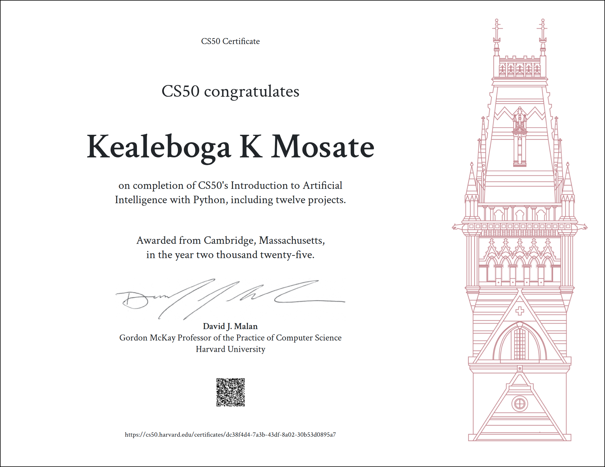

# 🤖 CS50's Introduction to Artificial Intelligence with Python



Welcome to my personal repository for **CS50's Introduction to Artificial Intelligence with Python**, a course by Harvard University. This course introduces fundamental concepts in AI, and this repository showcases my solutions, implementations, and insights as I worked through the projects.

**Author**: Kealeboga K Mosate

---

## 🧠 What I Learned

Throughout the course, I learned and implemented:

- **Search algorithms** (DFS, BFS, A\*)
- **Knowledge representation** using propositional logic and model checking
- **Uncertainty** with Bayesian networks
- **Optimization** with Constraint Satisfaction Problems
- **Learning** with machine learning models (Naive Bayes, k-NN, etc.)
- **Natural Language Processing** and word embeddings
- **Reinforcement Learning** with Q-learning
- **Neural Networks** with TensorFlow

---

## 📁 Projects Overview

| Project             | Description                                                   |
| ------------------- | ------------------------------------------------------------- |
| Degrees             | Find shortest path between two actors using BFS               |
| Knights             | Solve logic puzzles with propositional logic                  |
| Minesweeper         | Build an AI that plays Minesweeper using logical inference    |
| Tic-Tac-Toe         | Play against an unbeatable AI using Minimax algorithm         |
| Crossword Generator | Solve crossword puzzles using constraint satisfaction         |
| Shopping            | Predict user behavior using k-nearest neighbors (k-NN)        |
| Language            | NLP for question answering with TF-IDF and word embeddings    |
| Traffic             | Model traffic patterns with reinforcement learning            |
| Neural Network      | Build and train a neural network from scratch with TensorFlow |

---


## 🚀 How to Run

1. Clone the repo:

   ```bash
   git clone https://github.com/your-username/CS50AI-Kealeboga.git
   cd CS50AI-Kealeboga

   ```

2. Create Virtual Invironment

```bash
python3 -m venv env
source env/bin/activate
```

3. Install required dependemcies

```bash
pip install -r requirements.txt

```


## 🚀 Course Link
🔗 CS50’s Introduction to Artificial Intelligence with Python


## 📜 License
This repository is for educational purposes and personal learning.
© 2025 Kealeboga K Mosate


## 🙌 Acknowledgments
Special thanks to:

Harvard University & CS50 Team for offering this amazing course.

The community of learners around the world sharing their insights.


```
